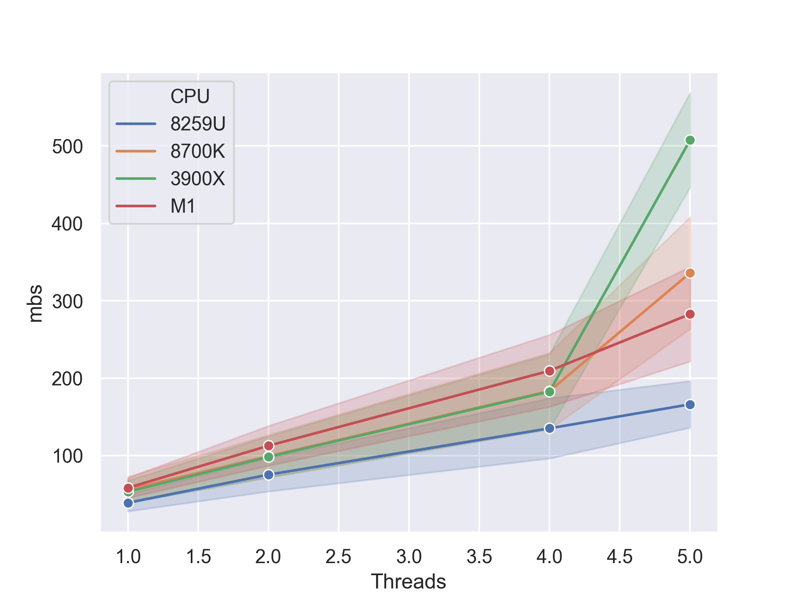
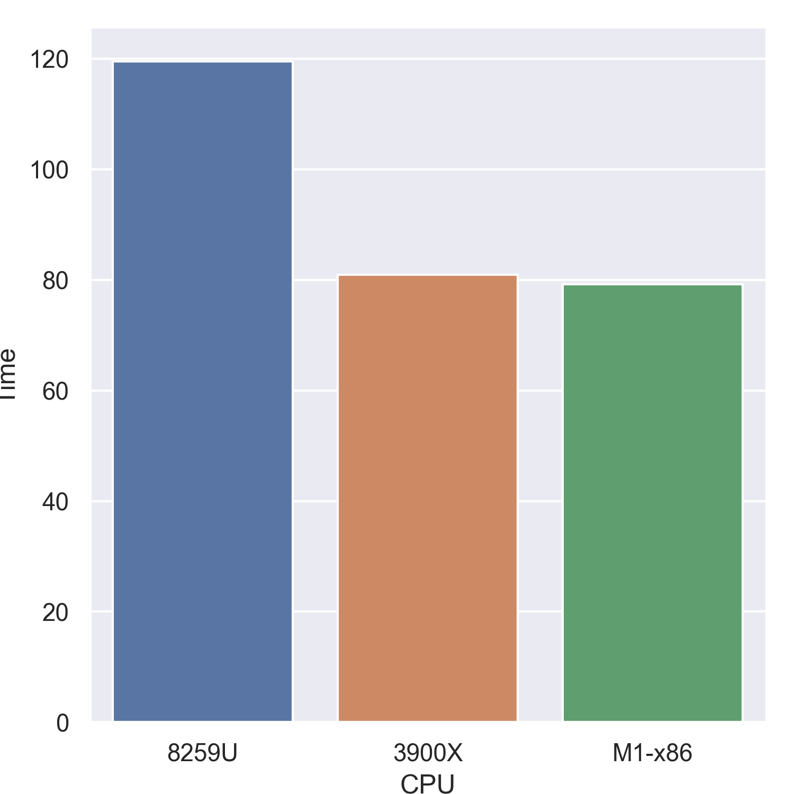
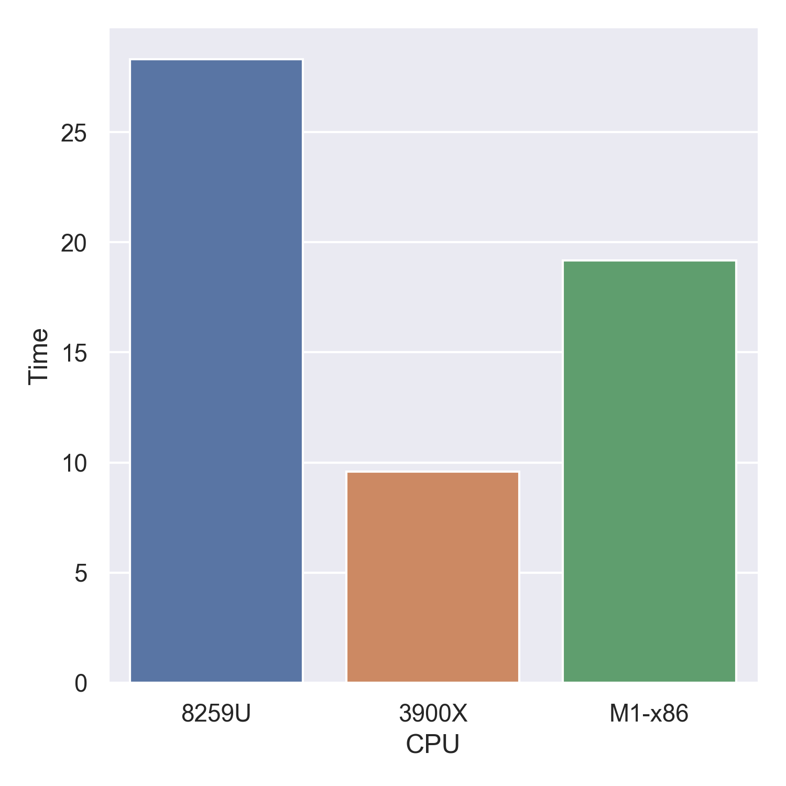
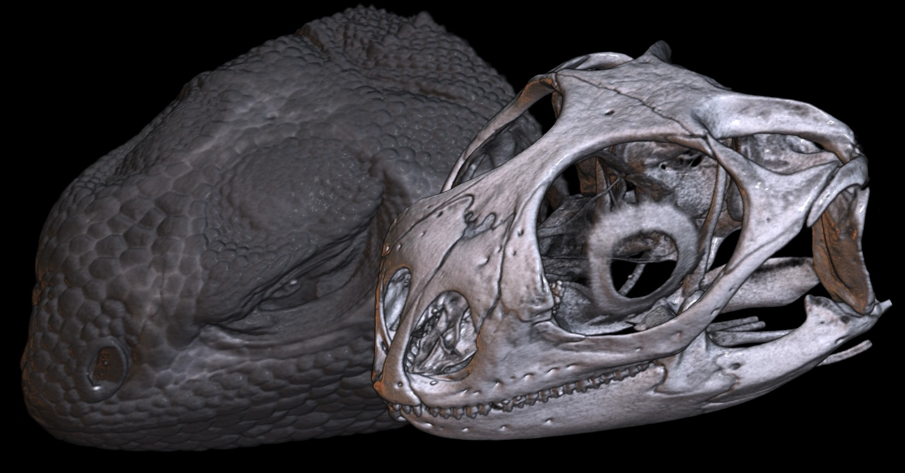
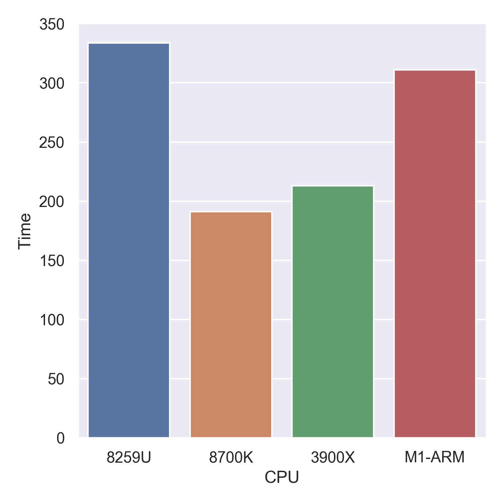

## About

Historically, Macintosh computers running macOS have been popular with brain imaging scientists. Since macOS runs Unix, users can often use the same tools on their laptop as the Linux workstations and super computers used for large datasets. However, this trend may change. First, the new [Windows Subsystem for Linux (WSL)](https://www.nemotos.net/?p=1481) has allowed Windows computers to seamlessly run Unix tools. Second, recent Macintosh computers have switched from Intel x86-64 processors to the ARM-based M1 `Apple Silicon`. This new architecture must translate existing code, and optimal performance will require tools to be recompiled. These two factors may make scientists reconsider future purchases. This page examines the potential for Apple Silicon to be used in brain imaging. 

## TL;DR

Unless you are a developer, I would strongly discourage scientists from purchasing an Apple Silicon computer in the short term. Productive work will require core tools to be ported. In the longer term, this architecture could have a profound impact on science. In particular if Apple develops servers that exploit the remarkable power efficiency of their CPUs and leverage the Metal language and GPUs for compute tasks (competing with NVidia's Tesla products and CUDA language).

## Limitations facing Apple Silicon

The infrastructure scientists depend on is not yet available for this architecture. Here are some of the short term limitations:

 - Scientists using the popular [R](https://developer.r-project.org/Blog/public/2020/11/02/will-r-work-on-apple-silicon/index.html) and Python languages require an open source [Fortran compiler](https://walkingrandomly.com/?p=6696). While Python is available on Apple Silicon, tools like Numpy and [Scipy](https://github.com/scipy/scipy/wiki/Dropping-support-for-Accelerate) require Fortran compilation. One solution is to install a Python distribution like [miniconda](https://docs.conda.io/en/latest/miniconda.html) and run its pip installer to add Intel packages (the scripts included in this repository include numpy, pandas, seaborn). There is a delay when one first imports one of these libraries while they are translated. Subsequently, the translated Python libraries appear to run well.
 - Current Apple Silicon compilers do [not support OpenMP](https://github.com/Homebrew/brew/issues/7857). Many scientific tools use this framework to implement parallel computing. This means most native tools will only be able to use a single CPU at a time (though note translated x86-64 OpenMP applications will run multi-threaded).
 - Docker does not [support Apple Silicon](https://www.docker.com/blog/apple-silicon-m1-chips-and-docker/). These containers are popular with many neuroimaging tools.
 - Many [homebrew components](https://github.com/Homebrew/brew/issues/7857) do not support Apple Silicon. Users will have to [install translated components](https://soffes.blog/homebrew-on-apple-silicon).
 - MATLAB is used by many scientific tools, including SPM. While [Matlab](https://www.mathworks.com/matlabcentral/answers/641925-is-matlab-supported-on-apple-silicon-macs) works in translation, it is not yet available natively (and mex files will need to be recompiled).
 - [FSL](https://www.jiscmail.ac.uk/cgi-bin/wa-jisc.exe?A2=ind2011&L=FSL&O=D&X=E5496FE3694704BA21&Y=rorden%40sc.edu&P=163954) and AFNI do not yet natively support this architecture. While code may work in translation, native tools supporting features like OpenMP must wait for compilers and libraries to be updated. This will likely require months.
 
There are some inherent weaknesses to using Macintosh for brain imaging:

 - NVidia graphics cards and therefore the CUDA language are not supported. Tools like [eddy](https://fsl.fmrib.ox.ac.uk/fsl/fslwiki/eddy), [Probtrackx](https://users.fmrib.ox.ac.uk/~moisesf/Probtrackx_GPU/index.html) and [Bedpostx](https://users.fmrib.ox.ac.uk/~moisesf/Bedpostx_GPU/Installation.html) are dramatically accelerated by this technology.
 - While Linux is open-source, Apple's software are opaque. While some of Apple's attempts to protect users computers may be well intentioned, they have had [unintended consequences](https://arstechnica.com/gadgets/2020/11/macos-big-sur-launch-appears-to-cause-temporary-slowdown-in-even-non-big-sur-macs/). A primary tenet of science is replication, and therefore transparent open source code has strong appeal. Scientists often share applications they develop with each other, and recent security features introduced by Apple can challenge this. Scientists, hobbyists and others who are not full time macOS developers will  find it difficult and expensive to support  the [complex](https://sigpipe.macromates.com/2020/macos-catalina-slow-by-design/) security features of macOS. Features like [Gatekeeper Path Randomization](https://weblog.rogueamoeba.com/2016/06/29/sierra-and-gatekeeper-path-randomization/), the requirement for all native Apple Silicon executables to be codesigned (locally with `codesign -s - exename`), quarantine of untrusted libraries (e.g. SPM and FSL both require calls like `xattr -dr com.apple.quarantine *.dylib`) and [application notarization](https://github.com/neurolabusc/NotarizeC) (which requires a $99 per year developer subscription) are all impediments for scientific applications.
 - Recent changes to macOS suggest it should be avoided for [visual stimulation, or DAQ digital/analog i/o, so running real data collection](http://psychtoolbox.org/requirements.html). 
 - Apple has [deprecated OpenGL](https://www.anandtech.com/show/12894/apple-deprecates-opengl-across-all-oses) encouraging developers to move to their modern Metal framework. Many scientific tools use OpenGL, and it is unrealistic to expect these developers to port their proven, robust tools. A few of the popular scientific tools that rely on OpenGL includes FreeSurfer, Connectome Workbench, AFNI, FSLeyes, Matlab, and Slicer 3D. It should be noted that OpenGL support for Apple Silicon is very good. It is unclear whether `deprecated` means `will not be updated` or `will be removed in an upcoming version of macOS`. If OpenGL support is removed, the operating system is no longer viable for neuroimaging research. Without clarification, developers of scientific software must seriously consider the investment they should make in supporting this operating system. 
 
 
## Potential for Apple Silicon

Initial reviews have suggested [Apple's M1 CPU has outstanding performance](https://www.anandtech.com/show/16252/mac-mini-apple-m1-tested). It includes [Rosetta2](https://www.anandtech.com/show/16252/mac-mini-apple-m1-tested/6), that will translate most x86-64 programs to Apple Silicon (AArch64) instructions providing seamless operation and reasonable performance. Indeed, as illustrated below the compatibility and performance of Rosetta2 is very impressive. There are specific features that are appealing for neuroimaging.

 - Of particular note for brain scientists is the incredible memory bandwidth. Our field has large datasets that tend to be memory rather than computation bound (the [memory wall](https://www.blosc.org/docs/StarvingCPUs-CISE-2010.pdf)).
 - While some operations lend themselves to the CPU, others are ideal for the GPU. An analogy would be transport via jet plane (CPU: moving a small amount fast), or super tanker (GPU: moving a huge amount with longer latency). However, many operations require sharing data between the [CPU and GPU](https://www.blosc.org/docs/StarvingCPUs-CISE-2010.pdf) so  [memory transfer](https://www.jiscmail.ac.uk/cgi-bin/wa-jisc.exe?A2=ind2004&L=FSL&P=R99017&X=F11DC25F019ED07848&Y=rorden%40sc.edu) can be the bottleneck. In contrast, the Apple M1 chip has unified memory, allowing the GPU and CPU to share memory without penalty.

## Testing

Four computers were tested:

 - MacBook Pro (2018) with Intel [i5-8259u](https://ark.intel.com/content/www/us/en/ark/products/135935/intel-core-i5-8259u-processor-6m-cache-up-to-3-80-ghz.html) (28w) four-core, eight-thread, integrated GPU.
 - Ubuntu 18.04 Intel [i7-8700k](https://ark.intel.com/content/www/us/en/ark/products/126684/intel-core-i7-8700k-processor-12m-cache-up-to-4-70-ghz.html) (95w) six-core, twelve-thread with NVidia GTX [1080 Ti](https://www.geforce.com/hardware/desktop-gpus/geforce-gtx-1080-ti/specifications) (250w) GPU.
 - Ubuntu 20.04 AMD [Ryzen 9 3900X](https://www.amd.com/en/products/cpu/amd-ryzen-9-3900x) (105w) twelve-core, twenty-four-thread  with NVidia GTX [1080 Ti](https://www.geforce.com/hardware/desktop-gpus/geforce-gtx-1080-ti/specifications) (250w) GPU. Tests were run on a RAM disk to maximize memory performance.
 - MacBook Air (2020) with Apple Silicon [M1](https://en.wikipedia.org/wiki/Apple_M1) (~15w) with four fast cores plus four efficiency cores and integrated GPU. Note this configuration does not have active cooling, so performance may be thermally constrained.

## pigz

The GZip compression format is a staple of neuroimaging, with NIfTI images often stored in GZip format. The compression is slow (relative to decompression), but the pigz tool can use multiple threads to accelerate compression. Indeed, popular tools like AFNI and dcm2niix can use pigz. Since pigz does not use OpenMP, it is easy to natively compile for Apple Silicon. A previous review of the Apple M1 CPU examined [pigz](https://arstechnica.com/gadgets/2020/11/hands-on-with-the-apple-m1-a-seriously-fast-x86-competitor/), however that review only examined the conventional version. Here we compare both conventional pigz with an accelerated version using the [CloudFlare zlib](https://github.com/cloudflare/zlib) which leverages dedicated hardware in both Intel and ARM computers. Here we tested compression of the [Silesia compression corpus](http://sun.aei.polsl.pl/~sdeor/index.php?page=silesia) using a simple [script](https://github.com/neurolabusc/pigz-bench-python).

The graph shows compression performance as megabytes per second, with higher values indicating faster performance. The horizontal axes shows the number of threads, with actual values for 1..4 and 5 representing the use of all available threads (e.g. 8 threads for the M1 but 24 for the 3900X). The shaded color for each line illustrates the performance difference between the standard pigz (bottom of shaded region) and the CloudFlare pigz (top of shaded region).

## AFNI

[AFNI](https://afni.nimh.nih.gov) is a popular software suite for brain imaging. It is a collection of executables written in C. Some tools use OpenMP for parallel processing. Native code for Apple Silicon will be limited by the fact that OpenMP C compilers are not expected until the middle of 2021. Further, it relies on libraries like [motif](https://sourceforge.net/projects/motif/) that are not yet available pre-compiled for Apple Silicon.

However, Rosetta2 seamlessly translates Intel binaries and libraries. Here I simply copied the executables and libraries from an Intel-based macOS computer and authorized them (e.g. `xattr -dr com.apple.quarantine 3d*`).

The graph below shows the geometric mean time for applying 3dcalc and 3dvolreg to a large resting state dataset. Lower values indicate better performance. Noat that the fanless M1 running translated code actually outpaces the desktop computer.

## FSL

fslmaths handles much of the internal processing for FSL, and is a popular stand-alone tool for computation. While [FSL](https://www.jiscmail.ac.uk/cgi-bin/wa-jisc.exe?A2=ind2011&L=FSL&O=D&X=E5496FE3694704BA21&Y=rorden%40sc.edu&P=163954) is not yet compiled for Apple Silicon, translations run seamlessly. On the other hand, the [niimath](https://github.com/rordenlab/niimath) clone can be compiled for Apple Silicon. Of specific interest, niimath for x86-64 can be compiled for OpenMP, providing a glimpse of parallel processing potential. Parallel processing is used for some computations and for saving data (using pigz). 

The graph shows the geometric mean for four computations (de-meaning, temporal filtering, Gaussian smoothing, image dilation) with lower values indicating faster performance. `FSL` denotes the performance of fslmaths. `Serial` is the performance of niimath using a single thread. `Parallel` is niimath using OpenMP (which is not yet available for the M1).  Note that when run in parallel on the M1, niimath uses translated x86-64 code for computations but native CloudFlare pigz for data compression. What is truly remarkable here is that the 15w M1 running translated code in parallel is keeping pace with the 105w Ryzen 3900X.
 

## SPM

[SPM12](https://www.fil.ion.ucl.ac.uk/spm/software/spm12/) is one of the dominant tools used for brain imaging. It uses Matlab along with compiled C code (mex files), both of which must currently be translated. In addition, the macOS is wary of the downloaded mex files, which look like malware. Therefore, users must [explicitly provide permission for these to be executed](https://transang.me/macos-open-file-from-unidentified-developers/) with a command like `xattr -dr com.apple.quarantine *.mexmaci64`. To evaluate the performance of SPM, I installed the [Clinical Toolbox](https://github.com/neurolabusc/Clinical) and timed the processing of the included tutorial dataset (`tic; clinical_mrnorm('T1.nii','lesionT2.nii','T2.nii'); toc`). 

## MRIcroGL

[MRIcroGL](https://github.com/rordenlab/MRIcroGL12/releases) is used for visualization of neuroimaging data. It is available for Linux, Windows and macOS. For macOS, a universal binary is provided that runs natively on both x86-64 and Apple Silicon. For Windows and Linux, OpenGL is used for visualization and some compute. For macOS versions are available for both OpenGL and Metal. The latter was used here (while deprecated on macOS, OpenGL performs well, albeit a bit slower). Testing involved a [digimorph desert iguana](http://digimorph.org/specimens/Dipsosaurus_dorsalis/) that used two 512mb textures of GPU memory. 

The first test examines the CPU performance, looking at the loading, scaling and transformation of the image data. A portion of these operations use hand-tuned vectorized SIMD SSE2 instructions for the x86-64 CPUs, with generic scalar instructions for the M1. The M1 would obviously benefit from SIMD Neon/SVE code. From this perspective, the ability of the fanless M1 to outpace the 28w Intel MacBook is impressive.

The second test examines the GPU compute performance, looking at generation of the intensity [gradients](https://www.mccauslandcenter.sc.edu/mricrogl/gradients).

## NaNs

Tools like SPM use the value [`Not a Number`](https://en.wikipedia.org/wiki/NaN) to signify data that should be ignored (e.g. voxels outside the brain). Any computation (addition, subtraction, division, multiplication, etc) that includes a NaN will result in a NaN. Old timers will remember the launch of the [Pentium 4](https://imaging.mrc-cbu.cam.ac.uk/imaging/SpmWithPentium4#c_nan_test) which had remarkable performance on paper, but exhibited poor performance with SPM. This was because the Pentium 4 floating point unit (FPU) had a huge penalty for any computation with a NaN. Users had to recompile their software to use the vectorized SSE instructions which did not exhibit this penalty. Testing of the [C and Matlab](https://imaging.mrc-cbu.cam.ac.uk/imaging/SpmWithPentium4#c_nan_test) code suggests that the M1 does not exhibit a NaN penalty, and indeed can be faster for NaNs (since no real computation needs to be done).

## Double-precision floating-point format

While 32-bit (FP32) computations are sufficient for most needs, some scientific tools demand double-precision floating-point format ([FP64](https://en.wikipedia.org/wiki/Double-precision_floating-point_format)). Indeed, tools like Matlab use FP64 by default and are tuned for this datatype. FP64 has demands for speed, efficiency and bandwidth. It is common for consumer devices like video gaming graphics cards to devote fewer resources to [FP64](https://www.microway.com/knowledge-center-articles/comparison-of-nvidia-geforce-gpus-and-nvidia-tesla-gpus/) than graphics cards used for industrial compute applications. Given the M1's heritage as a processor for consumer mobile phones, one might wonder if the FP64 performance has been compromised. To investigate this,  [niimath](https://github.com/rordenlab/niimath) was run with both FP64 and FP32 datatypes. The penalty for FP64 seems minimal, emphasizing the potential for scientific applications.

## Conclusions

It is remarkable that the M1 CPU in the MacBook Air has no fan, yet holds its own in these neuroimaging benchmarks. The promise of this architecture is hard to deny.

## Links

 - [AnandTech](https://www.anandtech.com/show/16252/mac-mini-apple-m1-tested) provides a deep dive into the workings of the new M1 chip and its performance.
 - [Arstechnica](https://arstechnica.com/gadgets/2020/11/hands-on-with-the-apple-m1-a-seriously-fast-x86-competitor/) reviews M1 performance.
 - [Phoronix](https://www.phoronix.com/scan.php?page=article&item=apple-mac-m1&num=1) explores native and translated M1 performance on many benchmarks.
 - [PugetSystems](https://www.pugetsystems.com/labs/articles/Apple-M1-MacBook-vs-PC-Desktop-Workstation-for-Adobe-Creative-Cloud-1975/) examines M1 laptops versus x86-64 workstations. The professional applications leverage multiple threads and modern GPUs to the hilt. 
 
